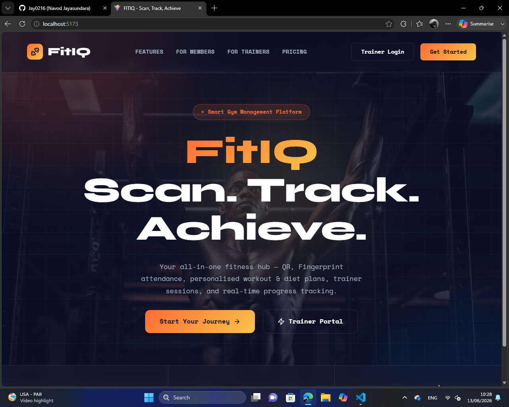
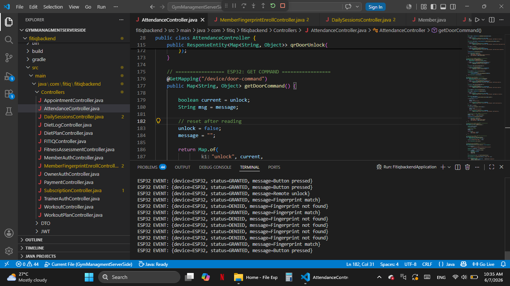
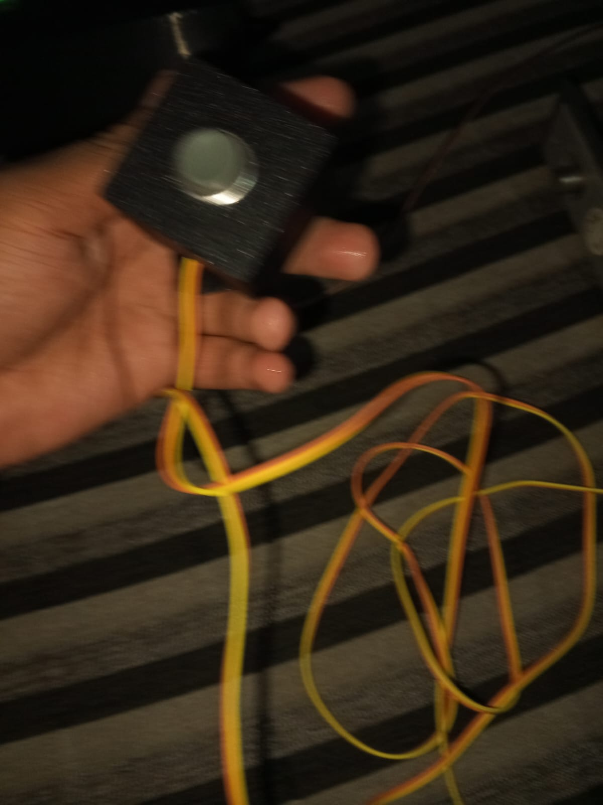

# FITIQ

# IoT Gym Access Control System (In Progress)

## 📌 Project Overview
An IoT-based gym access management system developed for a client.  
The system integrates ESP32 microcontrollers with a Spring Boot backend and React frontend to enable secure, real-time gym entry control using fingerprint authentication, remote commands, and hardware-based access control.

> ⚠️ This project is currently under active development.

---

## 🏗️ System Architecture
- ESP32 (Arduino C++) handles hardware interactions (fingerprint, relay, LCD)
- Spring Boot backend manages APIs, access control logic, and event handling
- React frontend provides admin/user interface for monitoring and management
- MySQL database stores users, access logs, and device events

---

## ⚙️ Technologies Used
- ESP32 (Arduino C++)
- Spring Boot (Java)
- React
- MongoDB
- REST APIs
- JWT Authentication
- IoT Device Communication

---

## 📸 Project Screenshots

---

### 🔹 Developed System (Current Progress)
<!-- Add your developed system images here -->
  

---

### 🔹 Hardware Setup (ESP32)
<!-- Add ESP32 / wiring / device images -->

---

## 🔌 Features (In Progress)
- Fingerprint-based authentication system
- Real-time door access control using ESP32
- Remote unlock via backend API
- Event logging (GRANTED / DENIED access)
- LCD status display feedback
- Admin monitoring system (React dashboard)

---

## 🚧 Project Status
This project is currently under active development for a client.  
Features and integrations are being continuously improved and tested.

---
